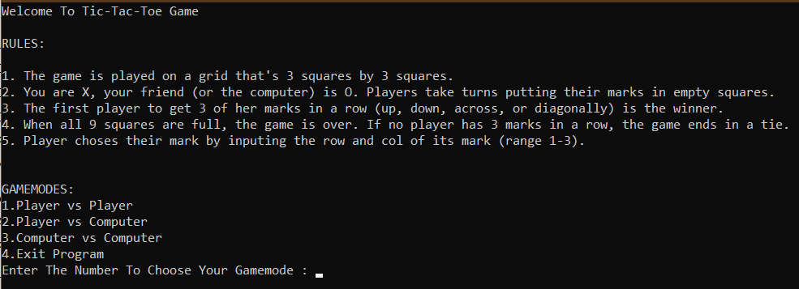

# AI Tic-Tac-Toe Game
>This is a simple game coded by me in python which uses the minimax algorithm to develop an AI to play the game in single player.



## Prerequisite

This game requires the numpy module to work in Python:

```python
pip install numpy
```

## How To Play
>To run the game, run main.py
>There are 3 game modes to choose from 
>1. Player Vs. Player
>2. Player Vs. Computer (You Will Either Draw or Lose)
>3. Computer Vs. Computer (Will Always End Up In A Draw)

## Release History

* 1.0.0
    * Final Release
* 0.2.1
    * Fix: Incorrect Output when `score()` was called.
* 0.2.0
    * Introduced the AI Component to play Player Vs. Computer and Computer Vs. Computer
* 0.1.0
    * The first proper release (only included Player Vs. Player)
* 0.0.1
    * Work in progress

## Meta

Hoshner Tavadia – hoshnertavadia@gmail.com

Distributed under the GPL-3.0License. See ``LICENSE`` for more information.

[https://github.com/tavadia-hoshner/](https://github.com/tavadia-hoshner/)
